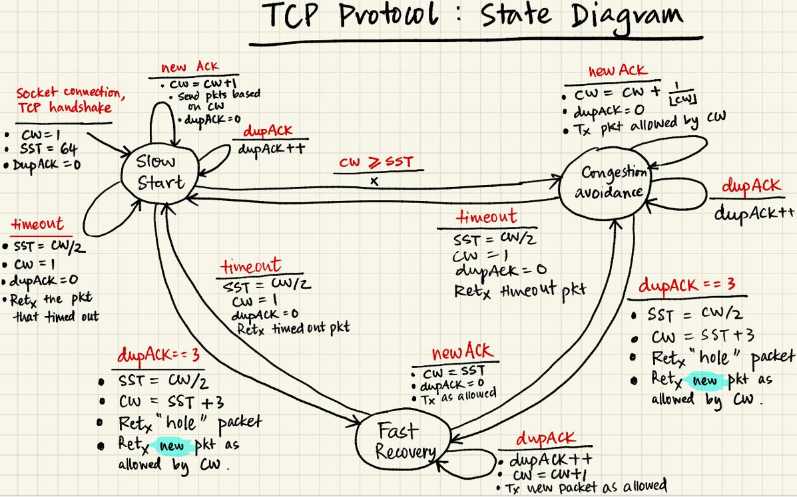

# TCP Simulation

This project follows the instruction of UIUC ECE438 (fa21), MP2. The `mp2.pdf` specify the requirements. The idea is to simulate a TCP protocol with UDP, to realize reliable data transfer even when there is delay or packet loss in the network. 

Author of this project: [Zhongbo Zhu](https://github.com/zzb66666666x) and [Xiwei Wang](https://github.com/Xiwei-Wang).

#### How to run

Make sure you are in linux. You can open two virtue machines and configure the VM settings by setting their network to be host-only so that the two machines can talk to each other. 

Then compile the code by `make`.

Then in test time, we can first configure the network card to loss packet and add network delay.

```
sudo tc qdisc del dev ens33 root 2>/dev/null
sudo tc qdisc add dev ens33 root handle 1:0 netem delay 20ms loss 5%
sudo tc qdisc add dev ens33 parent 1:1 handle 10: tbf rate 20Mbit burst 10mb latency 1ms
```

Then suppose the put `lecture.mp4` in data folder, we can begin to transfer it using simulated TCP.

```
vm01:
    ./reliable_sender 192.168.10.129 5000 data/lecture.mp4 285647460
vm02:
    ./reliable_receiver 5000 data/recv_lecture.mp4 
```

Here, the parameters are: IP, port, filename, bytes_to_transfer.

#### TCP State Machine

image author: [ Romit Roy Choudhury @ UIUC \] (illinois.edu)](https://croy.web.engr.illinois.edu/)



